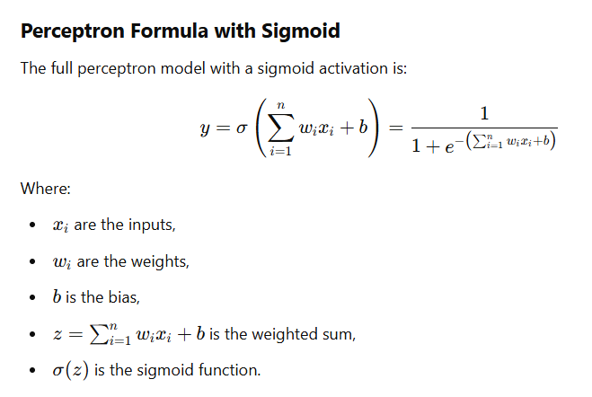

**An artificial perceptron**

An artificial perceptron is a computational model that processes input signals, applies weights to those inputs, sums them, and passes the result through an activation function to produce an output.
Basic formula is below

The perceptron consists of the following components:

1. Inputs - signals or data values provided to the perceptron (e.g., features of a dataset).
2. Weights - values that determine the importance or influence of each input.
3. Weighted Sum - a linear combination of the inputs and their weights, calculated as:

For current example:
* inputs=[0,0,1], 
* weights=[10,0,−5]

where inputs and weights given from the current project example 

perceptron_formula_with_sigmoid
Here is a perceptron with a sigmoid activation function is a model of a simple artificial neuron that uses the sigmoid function to determine its output. This setup allows the perceptron to output values in a continuous range between 0 and 1, making it useful for tasks such as binary classification or as a building block in larger neural networks. 

Computed weight sum 𝑧 shows that z=(10⋅0)+(0⋅0)+(−5⋅1)=0+0−5=−5
or z=(10⋅0)+(0⋅0)+(−5⋅1)+0=−5
Bias (𝑏) is set to 0, it means the perceptron does not adjust its weighted sum  beyond the input and weight contributions. 

