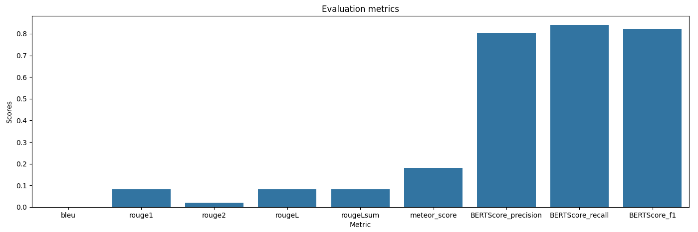

# Project overview

1. project name: [prompt_evaluation_guide](scr/prompt_evaluation_guide)
2. implementation of: transformer model (gpt2)
3. dependencies: transformers datasets torch matplotlib seaborn

## Virtual environment configuration

Create virtual environment.
To create a virtual environment, execute the following commands in the command line:

```bash
pip install virtualenv
```

To activate the virtual environment:

```bash
venv\Scripts\activate
```

Install required packages

```bash
pip install transformers datasets torch matplotlib seaborn tf-keras
```

## Other installation/configuration staff

`train.py` required additional instalation of `transformers[torch]` by

```
pip install transformers[torch]
```

### Check installed version of python package

For checking version of installed python package use

```
pip freeze | findstr {desiered_package_name}
```  

e.g. for `transformers` use

```
pip freeze | findstr transform
```

or for `tensorflow`

```
pip freeze | findstr tensorflow
```

## Usage

### Train

Execute `train.py` or other `train...py` file. Read comments in the train files.

#### Training results

1. Training of `train_by_GPT2_2.py`, for dataset `custom_dataset_for_addiction_research.json` with content

```commandline
 {"prompt": "What is addiction?", "response": "Addiction is a chronic brain disorder characterized by compulsive drug use despite harmful consequences."}
 {"prompt": "Define substance use disorder.", "response": "Substance use disorder is a condition in which a person has an uncontrolled dependence on a substance."}
 {"prompt": "What are the common symptoms of addiction?", "response": "Symptoms include cravings, loss of control, and continuing to use despite adverse effects."}
 {"prompt": "How does addiction affect the brain?", "response": "Addiction alters brain function, affecting reward, motivation, and decision-making pathways."}
 {"prompt": "What role does dopamine play in addiction?", "response": "Dopamine is a neurotransmitter involved in the brain's reward system, often hijacked by addictive substances."}
 {"prompt": "What is withdrawal?", "response": "Withdrawal refers to the physical and psychological symptoms experienced when a dependent person stops using a substance."}
 {"prompt": "Can addiction be genetic?", "response": "Yes, genetic factors can influence susceptibility to addiction."}
 {"prompt": "What is the role of environment in addiction?", "response": "Environmental factors, such as peer pressure and trauma, significantly contribute to addiction risk."}
 {"prompt": "What is behavioral addiction?", "response": "Behavioral addiction involves compulsive engagement in non-substance activities like gambling or gaming."}
 {"prompt": "What therapies are effective for addiction?", "response": "Cognitive-behavioral therapy (CBT) and motivational interviewing are commonly used in treatment."}
```

completed with

```
{'train_runtime': 482.0742,
 'train_samples_per_second': 0.062,
  'train_steps_per_second': 0.006, 
  'train_loss': 6.284261067708333, 
  'epoch': 3.0}
```

### Evaluation

1. Execute `prompt_evaluation_for_BLEU.py` is not require any additional installation.
1. Execution `prompt_evaluation_for_BLEU_ROUGE_Meteor_BertScore.py`
    1. For `prompt_evaluation_for_BLEU_ROUGE_Meteor_BertScore.py` add additional installations
        1. **_ROUGE scores_** requires additional installation. Install it via `pip install rouge_score`
        2. **_BERTScore requires_** additional installation. Install it via `pip install bert-score`.
   
### Visualisation

Assume that we have

```
{
    "bleu": 0.0,
    "rouge1": 0.08333333333333334,
    "rouge2": 0.02173913043478261,
    "rougeL": 0.08333333333333334,
    "rougeLsum": 0.08333333333333334,
    "meteor_score": 0.18187830687830692,
    "BERTScore_precision": 0.8050856292247772,
    "BERTScore_recall": 0.8402203917503357,
    "BERTScore_f1": 0.822277158498764
}
```

Result of visualisation is


## Script execution issues

### 'tensorflow' - slightly different numerical results

For `python 3.12` for `tensorflow==2.18.0` + `tensorflow_intel==2.18.0`
Default `train.py` shows notification

```commandline
I tensorflow/core/util/port.cc:153] oneDNN custom operations are on. You may see slightly different numerical 
results due to floating-point round-off errors from different computation orders. To turn them off, set the environment variable `TF_ENABLE_ONEDNN_OPTS=0`.
```

## Improvements

**Prompt Engineer** improvements for the model performance can be implemented based on the evaluation metrics and the
provided GPT-2 configuration.
Below are some suggestions.

### 1. **Data Preprocessing and Augmentation**

- **Data Cleaning**: Ensuring that the training data is clean, well-structured, and consistent can eliminate noise or
  irrelevant content, which may negatively impact performance.
- **Augment Data**: Introducing more varied examples, especially for underrepresented topics, can help the model become
  more robust. Diverse sentence structures, word choices, and contexts enhance its ability to generalize.

### 2. **Prompt Optimization**

- **Refining Prompts**: Crafting more precise and detailed prompts to guide the model toward generating more accurate
  and relevant responses is critical.
- **Incorporate Context**: Context-rich prompts, such as multi-turn conversations or detailed instructions, ensure that
  the model outputs coherent and relevant responses.
- **Temperature and Sampling**: Modifying the `do_sample` setting and adjusting parameters like `top_k` or `top_p` can
  control the randomness and creativity of the model’s output. A lower temperature (e.g., 0.7) reduces randomness,
  generating more deterministic responses.

### 3. **Model Hyperparameters Adjustment**

- **Increase Layers or Heads**: Adjusting the number of layers or attention heads can allow the model to capture more
  complex patterns during training, potentially improving performance.
- **Experiment with `n_inner`**: Tuning the `n_inner` parameter, which controls the intermediate layer size in the
  transformer, may lead to better results, especially for more complex tasks.

### 4. **Fine-Tuning GPT-2**

- **Fine-Tuning with Task-Specific Data**: Fine-tuning the model on domain-specific datasets can improve its performance
  on targeted tasks. Customizing the model for specific use cases helps it learn patterns that are more relevant.
- **Transfer Learning**: Leveraging transfer learning by starting with a pre-trained GPT-2 model and fine-tuning it on a
  specific task or corpus can lead to better performance without starting from scratch.

### 5. **Evaluation Metric-Specific Adjustments**

- **BLEU**: Since BLEU currently scores 0.0, which suggests poor overlap with reference texts, focusing on improving
  lexical similarity through better training data can help. Ensuring high-quality reference texts can also improve this
  metric.
- **ROUGE**: Improving ROUGE scores can be achieved by crafting more informative prompts that encourage the model to
  capture key content and phrases from the reference text.
- **METEOR**: Since METEOR accounts for synonyms and paraphrases, enhancing the model's understanding of semantic
  equivalence can improve this score. Data augmentation or adversarial training may help in this regard.
- **BERTScore**: To improve BERTScore, focusing on improving the quality of embeddings can lead to better performance.
  Fine-tuning GPT-2 alongside BERT-based models can result in better contextual word representations.

### 6. **Regularization Techniques**

- **Dropout Regularization**: Modifying dropout parameters like `attn_pdrop` and `embd_pdrop` helps prevent overfitting,
  leading to better generalization in unseen data.
- **Layer Normalization**: Ensuring optimal `layer_norm_epsilon` values stabilizes learning and helps prevent issues
  like vanishing gradients.

### 7. **Model Size and Parameters**

- **Larger Models**: Using larger models, such as GPT-2 Medium, Large, or GPT-3, can provide more capacity for handling
  complex tasks and can improve performance on a variety of metrics.
- **Learning Rate and Optimizer Tuning**: Tuning the learning rate and experimenting with different optimizers (e.g.,
  AdamW) can improve model convergence, avoiding issues like poor local minima or vanishing gradients.

### 8. **Loss Function Adjustments**

- **Loss Function Tweaks**: Modifying the loss function (e.g., from cross-entropy to other variations) could enhance
  performance for specific tasks, such as summarization or question answering.

### 9. **Sampling Strategies**

- **Top-k Sampling**: Adjusting the `top_k` parameter during text generation to sample from the top K most likely words
  can prevent the model from generating repetitive or irrelevant output.
- **Nucleus Sampling**: Adjusting the `top_p` value ensures that words are sampled from the cumulative probability
  distribution of the top P words, allowing for more diversity in the output while avoiding poor-quality predictions.

### 10. **Model Evaluation and Iteration**

- **Cross-validation**: Implementing cross-validation to evaluate different configurations and fine-tuned models helps
  identify the optimal setup.
- **Hyperparameter Search**: Running a hyperparameter search (e.g., grid search, random search) can assist in finding
  the best combination of hyperparameters for improving performance metrics.

### Example Implementation:

```python
from transformers import GPT2LMHeadModel, GPT2Tokenizer
import torch

# Load pre-trained model and tokenizer
model = GPT2LMHeadModel.from_pretrained('gpt2')
tokenizer = GPT2Tokenizer.from_pretrained('gpt2')

# Refine the prompt to improve results
prompt = "Describe the importance of artificial intelligence in healthcare."

# Generate text using refined prompt
inputs = tokenizer(prompt, return_tensors="pt")
outputs = model.generate(**inputs, max_length=100, do_sample=True, top_p=0.95, top_k=60)

# Decode and print the output
generated_text = tokenizer.decode(outputs[0], skip_special_tokens=True)
print(generated_text)
```

## Examples for different datasets
1. custom_dataset_for_addiction_research.json
* Dataset `custom_dataset_for_addiction_research.json` with content

```commandline
 {"prompt": "What is addiction?", "response": "Addiction is a chronic brain disorder characterized by compulsive drug use despite harmful consequences."}
 {"prompt": "Define substance use disorder.", "response": "Substance use disorder is a condition in which a person has an uncontrolled dependence on a substance."}
 {"prompt": "What are the common symptoms of addiction?", "response": "Symptoms include cravings, loss of control, and continuing to use despite adverse effects."}
 {"prompt": "How does addiction affect the brain?", "response": "Addiction alters brain function, affecting reward, motivation, and decision-making pathways."}
 {"prompt": "What role does dopamine play in addiction?", "response": "Dopamine is a neurotransmitter involved in the brain's reward system, often hijacked by addictive substances."}
 {"prompt": "What is withdrawal?", "response": "Withdrawal refers to the physical and psychological symptoms experienced when a dependent person stops using a substance."}
 {"prompt": "Can addiction be genetic?", "response": "Yes, genetic factors can influence susceptibility to addiction."}
 {"prompt": "What is the role of environment in addiction?", "response": "Environmental factors, such as peer pressure and trauma, significantly contribute to addiction risk."}
 {"prompt": "What is behavioral addiction?", "response": "Behavioral addiction involves compulsive engagement in non-substance activities like gambling or gaming."}
 {"prompt": "What therapies are effective for addiction?", "response": "Cognitive-behavioral therapy (CBT) and motivational interviewing are commonly used in treatment."}
```

* Training by `train_by_GPT2_2.py` completed with
```
{'train_runtime': 482.0742,
 'train_samples_per_second': 0.062,
  'train_steps_per_second': 0.006, 
  'train_loss': 6.284261067708333, 
  'epoch': 3.0}
```

* Prompt evaluation and score by `prompt_evaluation_for_BLEU_ROUGE_Meteor_BertScore.py`
      with
       - `prompts = ["How does addiction affect the brain?", "What role does dopamine play in addiction?"] # this is for custom_dataset_for_addiction_research.json`
       - `references = [["Addiction alters brain function, affecting reward, motivation, and decision-making pathways."], ["Dopamine is a neurotransmitter involved in the brain's reward system, often hijacked by addictive substances."]]  # # this is for custom_dataset_for_addiction_research.json`

shows metrics
```
{
    "bleu": 0.0,
    "rouge1": 0.12899896800825594,
    "rouge2": 0.0,
    "rougeL": 0.11145510835913311,
    "rougeLsum": 0.11145510835913311,
    "meteor_score": 0.22276520249881004,
    "BERTScore_precision": 0.8278552889823914,
    "BERTScore_recall": 0.8728640377521515,
    "BERTScore_f1": 0.8497079610824585
}
```
* vizualisation


## F.A.Q
### Metrics
#### ROUGE
- **Description**: ROUGE (Recall-Oriented Understudy for Gisting Evaluation) measures the overlap between generated text and reference text.
- **Parameters**:
  - `rouge1`: Unigram overlap (single words).
  - `rouge2`: Bigram overlap (two-word sequences).
  - `rougeL`: Longest Common Subsequence (LCS).
- **Purpose**: Evaluates lexical similarity, fluency, and coherence across different levels (unigrams, bigrams, and sequences).

#### METEOR
- **Description**: Evaluates semantic similarity by considering unigram overlaps, stemming, synonyms, and paraphrasing.
- **Score Parameter**: `meteor_score`
- **Purpose**: Provides a balanced metric for machine translation and summarization tasks.

#### BERTScore
- **Description**: Leverages contextual embeddings from BERT to evaluate semantic similarity between the generated and reference text.
- **Parameters**:
  - `BERTScore_precision`: Measures how much of the generated text matches the reference.
  - `BERTScore_recall`: Measures how much of the reference text is covered by the generated text.
  - `BERTScore_f1`: Harmonic mean of precision and recall.
- **Purpose**: Captures semantic similarity more effectively than traditional n-gram-based metrics.

